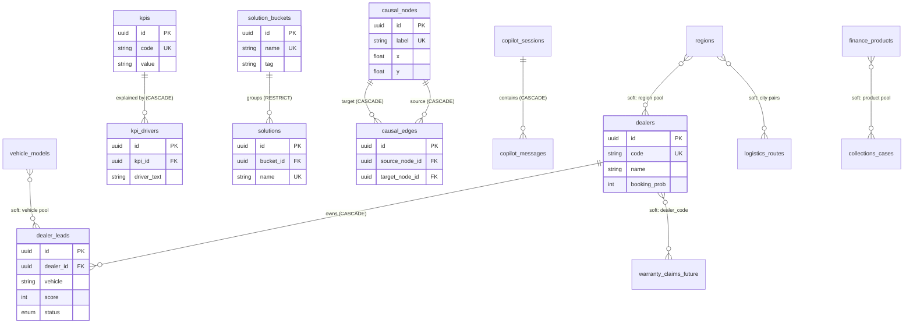

# Entity Relationships

Two layers of relationships matter in this project:

1. **Hard FK relationships** — physical constraints in PostgreSQL.
2. **Soft business relationships** — cross-module consistency chains built
   into the generators so the datasets tell one coherent story.

## 1. Physical ER diagram



### FK rules

| Child → Parent | On delete | Cardinality | Notes |
|---|---|---|---|
| dealer_leads → dealers | CASCADE | 1:N | leads ordered by `sort_order` |
| kpi_drivers → kpis | CASCADE | 1:N | drivers ordered by `sort_order` |
| solutions → solution_buckets | RESTRICT | 1:N | buckets cannot be deleted while solutions exist |
| causal_edges → causal_nodes | CASCADE (×2) | N:M via edge table | UNIQUE(source, target) |
| copilot_messages → copilot_sessions | CASCADE | 1:N | runtime traffic only |

The remaining tables are intentionally **flat** (no FKs): they mirror the
frontend mock-data shape where each screen owns its rows. Cross-module links
are semantic, expressed through shared reference pools (see below).

## 2. Soft (business) relationships

These are enforced by the generators, not by constraints. They are what make
the dataset feel like one enterprise instead of random tables.

### The core correlation chain

```
High lead quality
  → higher booking probability
    → higher finance approval
      → higher customer satisfaction (CSAT/NPS)
```

Implemented in `data/generators/common.py::business_chain_score()` and reused
by: dealer_generator (dealers + leads), customer_generator (twins),
finance_generator (product risk), collections_generator (recovery prob),
mobility_generator (node metrics), overview_generator (executive KPIs).

### Shared reference pools

| Pool | Consumers |
|---|---|
| `REGIONS` (West/North/South/East) | dealers, logistics routes, simulations, recommendations, trust decisions, prompts |
| `REGION_CITIES` (26 Indian cities) | dealer names/locations, customer twins, routes, Q&A |
| `VEHICLE_MODELS` (XUV700, Scorpio-N, Thar, Bolero, XUV 3XO) | dealer leads, simulations, prompts, warranty claims |
| Finance product names | collections cases (delinquent product) |
| Dealer codes (`syn-dNNN`) | warranty claims, notifications (future datasets) |

### Cross-module narrative links

| Link | Where it appears |
|---|---|
| Warranty batch **B-2141** flagged | mobility causal node metric → recommendation "Quarantine warranty batch B-2141" → ~15% of future warranty_claims |
| Dealer funnel aggregates | executive `kpis` values computed from dealer/lead populations (not invented) |
| Finance approval rate | mobility KPI + Finance Approval node metric + customer twin approval mix — same chain value |
| RVSF batches (Nagpur/Chennai) | carbon credit codes + dMRV Q&A category |
| Suggested copilot prompts | templated over the same cities/regions/models so answers exist in causal_qa |
| Simulation domains | inputs/outputs mirror the engine schemas; collections sim correlates with finance chain |

## 3. Seeding order (derived from relationships)

Parents always load before children — this is the fixed `LOAD_ORDER` in
`backend/database/seed_database.py`:

```
regions, vehicle_models, users
→ dealers → dealer_leads
→ customer_twins, finance_products, collections_agents, collections_cases
→ warehouse_signals, logistics_routes, carbon_credits
→ trust_decisions, compliance_rules, ai_agents, xr_experiences
→ causal_nodes → causal_edges
→ mobility_kpis, causal_qa
→ kpis → kpi_drivers, recommendations
→ solution_buckets → solutions, poc_items
→ suggested_prompts, simulation_runs
```

FK UUIDs never require a database lookup: child rows recompute the parent
UUID from the parent's natural key (`uuid5(SYNTHETIC_NAMESPACE,
"synthetic:<table>:<natural-key>")`).
